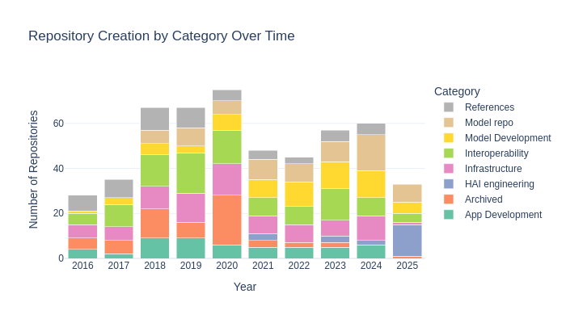
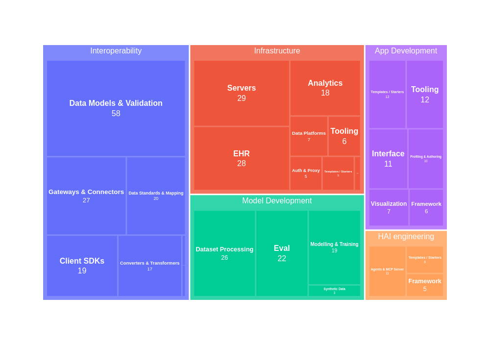
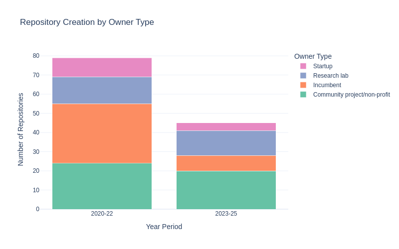

# Healthcare AI Repository Dashboard 🏥

Tracking the open-source healthcare AI ecosystem: 600+ repositories across
interoperability, model development, infrastructure and engineering tooling,
refreshed quarterly.

**[Live dashboard →](https://dotimplement-healthcare-ai-dashboard.streamlit.app/)**



## What's here

| | |
|---|---|
| **Repositories tracked** | 623 (599 after excluding link collections and docs) |
| **Unique owners** | 385 |
| **Star events** | 116k, across the top 100 repos by stars |
| **Data as of** | 2025-11-17 |

<p align="center">
  
  
</p>

All 20 published charts live in [`nice_plots/`](nice_plots/) and are regenerated
from [`charts.py`](charts.py).

## Quick start

```bash
uv sync
uv run streamlit run main.py     # interactive dashboard
uv run marimo edit charts.py     # chart pipeline / EDA notebook
uv run pytest                    # data contract tests
```

## Layout

```
healthcare_ai/
  config.py         All thresholds, paths, date bounds and category lists
  data.py           Loading and derived columns -- the single definition,
                    shared by the dashboard and the charts
  owner_types.py    Owner -> ownership category, backed by owner_types.yaml
  owner_types.yaml  The curated taxonomy (hand-maintained)
  github_api.py     Owner classification and contributor statistics
  stars.py          Star history fetching, incremental
main.py             Streamlit dashboard
charts.py           marimo notebook -- publication charts and EDA
refresh.py          Quarterly pipeline orchestrator
tests/              Data contract tests
```

## Data

`healthcare_data.csv` is the seed dataset and is **maintained by hand** — the
category, subcategory and standard columns are editorial judgements. Everything
else is derived from it:

```
healthcare_data.csv  (manual)
  ├─> repos_classified*.csv              github_api.py --mode classify
  ├─> contributor_detailed_stats*.csv    github_api.py --mode contributions
  └─> star_events_history.csv            stars.py
        └─> nice_plots/*.png             charts.py
```

Two invariants worth knowing:

- **Activity is measured against the data, not the clock.** A repo is "Active"
  if it was committed to within 365 days of the most recent commit *in the
  dataset*. Using wall-clock time meant a frozen dataset silently drifted
  towards "everything is inactive" between refreshes.
- **Chart year bounds are derived.** The upper bound follows the data, so a
  refresh that adds a new year extends the charts rather than dropping it.

Both are enforced by tests.

## Refreshing

See **[REFRESH.md](REFRESH.md)** for the full quarterly runbook.

```bash
echo "GITHUB_TOKEN=ghp_..." > .env
uv run python refresh.py
```

## License

[MIT](LICENSE)
